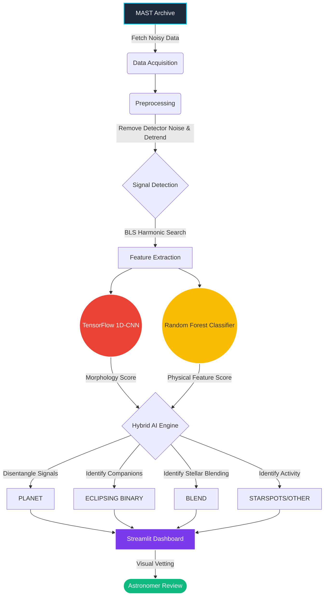

# NakshatraNetwork: AI-Powered Exoplanet Detection Pipeline 🔭

**A comprehensive, AI-based data analysis pipeline capable of automatically detecting exoplanet transit signals from noisy astronomical light curve data, built for the Bharatiya Antariksh Hackathon 2026.**

---

## 🌟 The Opportunity & Problem Statement

### How will it be able to solve the problem?
Exoplanet detection through transit photometry requires identifying extremely small brightness variations in stars. This is notoriously difficult when dealing with noisy datasets in **crowded fields**, where light curves suffer from significant contamination. **NakshatraNetwork** solves this by employing a hybrid Machine Learning approach capable of disentangling these distinct features. 

The pipeline specifically addresses:
1. **Detector & Intrinsic Noise:** Applies robust preprocessing (sigma-clipping and median detrending) to mitigate the intrinsic noise in the data due to the detector’s response.
2. **Contamination & Stellar Blending:** Extracts advanced morphological features (like odd/even depth ratios and secondary eclipses) to identify false positives caused by stellar blending from foreground or background sources in the aperture.
3. **Signal Disentanglement:** Uses a sophisticated AI classification engine to accurately distinguish between true **transiting planets**, **eclipsing stellar companions** in binary star systems, and **starspots**.

### How different is it from any of the other existing ideas?
Many existing AI-based exoplanet detectors (like Google's AstroNet) rely *exclusively* on Deep Learning, treating the problem as a pure sequence-classification task. This "black box" approach often struggles to generalize across extremely noisy datasets or crowded stellar fields because it ignores explicit physical laws.

**NakshatraNetwork** is fundamentally different because it utilizes a **Multi-Modal Hybrid AI Architecture**:
Instead of relying solely on a neural network, it runs a **1D Convolutional Neural Network (CNN)** in parallel with a **Random Forest Ensemble**. 
1. The **1D-CNN** analyzes the *temporal morphology* (the raw visual shape) of the phase-folded light curve.
2. The **Random Forest** analyzes 30+ explicitly extracted *astrophysical domain features* (e.g., Box Least Squares Signal Detection Efficiency, secondary eclipse depths, and odd/even transit ratios).

By merging deep morphological representations with strict physical heuristics, NakshatraNetwork becomes highly interpretable and avoids the common pitfall of pure AI models being tricked by complex background stellar blending.

### USP (Unique Selling Proposition)
1. **Hybrid AI Interpretability:** Combines the pattern-matching power of Deep Learning (1D-CNN) with the explicit physical constraints of Traditional ML (Random Forest), making the AI's decisions transparent to astronomers.
2. **Resilience to Crowded Fields:** The dual-model approach is specifically engineered to filter out stellar blending and Eclipsing Binaries (EBs), drastically reducing the False Positive Rate (FPR) compared to pure CNN models.
3. **Interactive Triage:** An ultra-fast Streamlit dashboard allows astronomers to instantly review the AI model's candidates, visualizing the raw noise, the BLS periodogram, and the AI's multi-model confidence scores.

---

## ✨ Features

- **Automated Data Acquisition:** Interfaces with the MAST archive to fetch TESS Target Pixel Files (TPFs) and light curves.
- **Robust Preprocessing & Detrending:** Handles median filtering and outlier rejection to clean intrinsic detector noise.
- **Advanced Feature Extraction:** Extracts 30+ physical features including transit depth, Signal-to-Noise Ratio (SNR), and secondary eclipse flags.
- **Hybrid AI Classification (CNN + Ensemble):** Uses TensorFlow/Keras to process the raw light curve sequences, and scikit-learn ensembles to classify signals into `PLANET`, `ECLIPSING_BINARY`, `BLEND`, or `STARSPOT/OTHER`.
- **Interactive Dashboard:** A zero-config Streamlit web application for visual candidate vetting.

---

## 🛠️ Technologies Used

| Category | Technology / Library |
| :--- | :--- |
| **Language** | Python 3.10+ |
| **Deep Learning** | `TensorFlow` / `Keras` (1D-CNN) |
| **Machine Learning** | `scikit-learn` (Random Forest, XGBoost), `pandas`, `numpy` |
| **Astrophysics** | `lightkurve`, `astropy` (BoxLeastSquares), `batman-package` |
| **Web Dashboard** | `streamlit` |
| **Visualization** | `plotly`, `matplotlib` |

---

## 🏗️ Architecture & Process Flow Diagram

---

## 💻 UI Wireframes & Mockups

*(Note: In your PPT submission, replace this section with actual screenshots of your running Streamlit Dashboard)*

1. **Overview Tab:** Displays a pie chart of the AI's classification distribution (Planets vs Eclipsing Binaries vs Starspots).
2. **Light Curve Tab:** Shows the detrended, normalized flux over time using Plotly, highlighting how the AI handled intrinsic detector noise.
3. **Periodogram Tab:** Displays the BLS Power Spectrum with a vertical marker indicating the highest confidence orbital period.
4. **Phase Folded Tab:** Shows the light curve folded precisely over the predicted period to visualize the morphological differences between a "U"-shaped planetary transit and a "V"-shaped eclipsing binary.

---

## 💰 Estimated Implementation Cost

### Time Required
For a full-scale deployment processing an entire TESS Sector (approx. 20,000 targets):
- **Development/Setup Time:** 2-3 Weeks (Pipeline tuning, CNN training, dashboard deployment).
- **Processing Time per Target:** ~4-6 seconds (Downloading, detrending, BLS search, CNN inference).
- **Total Sector Processing Time:** ~24-30 hours on a standard multi-core machine.

### Compute Power & Infrastructure Cost
- **Local Prototyping (Free):** Can be run locally on a standard laptop with GPU acceleration (RTX 3060+) for fast 1D-CNN inference.
- **Production Compute (Cloud):** 
  - **AWS EC2 (g4dn.xlarge - 4 vCPUs, 16GB RAM, NVIDIA T4 GPU):** ~$0.52/hour. Processing an entire sector takes ~3 hours using batch inference = **~$1.50 per TESS Sector**.
  - **Storage:** ~50GB SSD for temporary FITS file caching = ~$4.00/month.
- **Hosting (Dashboard):** Streamlit Community Cloud (Free tier) or AWS App Runner (~$5-10/month).
- **Total Estimated Cost for Hackathon PoC:** **$0 (Open Source & Free Cloud Tiers)**.
- **Total Estimated Cost for Production Scale (All Sectors):** **<$50/month**.
